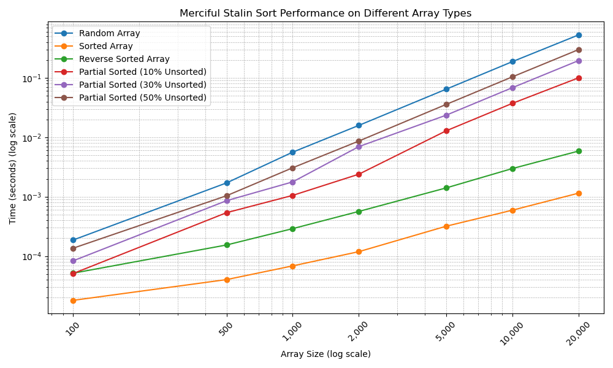

# Merciful Stalin Sort

The **Merciful Stalin Sort** is a new sorting algorithm inspired by the infamous [**Stalin Sort**](https://github.com/gustavo-depaula/stalin-sort). Instead of discarding out-of-order elements, it retains elements that are already in sorted order and collects the remaining elements to be sorted recursively. The main idea is to optimize sorting by reducing the size of the array that needs sorting, potentially improving performance on partially sorted arrays.


## Algorithm Summary

1. **Iterate through the array**, keeping elements that are in sorted order.
2. **Collect out-of-order elements** into a separate array.
3. **Recursively apply Merciful Stalin Sort** to the out-of-order elements.
4. **Merge** the sorted in-order elements with the recursively sorted elements.

This method combines aspects of merge sort due to the merging step and behaves like insertion sort when the array is already sorted.

## Pseudocode

```plaintext
function merciful_stalin_sort(arr):
    if length(arr) <= 1:
        return copy of arr

    array1 = empty list  // Elements in sorted order
    array2 = empty list  // Out-of-order elements

    prev = None

    for elem in arr:
        if prev is None or elem >= prev:
            array1.append(elem)
            prev = elem
        else:
            array2.append(elem)

    if array2 is empty:
        // Array is already sorted
        return copy of arr

    sorted_array2 = merciful_stalin_sort(array2)
    return merge_arrays(array1, sorted_array2)
```

## Empirical Results

The algorithm was benchmarked against traditional sorting algorithms:

- **Merge Sort**
- **Quick Sort**
- **Bubble Sort**
- **Insertion Sort**

Using arrays of varying sizes and initial orders:

- **Random Arrays**
- **Sorted Arrays**
- **Reverse Sorted Arrays**
- **Partially Sorted Arrays** with 10%, 30%, and 50% unsorted elements

### Results
Detailed benchmarking results can be found in the `results.txt` file.

### Performance Highlights

- **Random Arrays**: Underperforms compared to Merge Sort and Quick Sort but outperforms Bubble Sort and Insertion Sort.
- **Sorted Arrays**: Performs efficiently, similar to Insertion Sort, due to minimal required operations.
- **Reverse Sorted Arrays**: Performs poorly because of extensive recursion, significantly underperforming compared to all other algorithms.
- **Partially Sorted Arrays**: Shows improved performance with increased sortedness but still lags behind efficient algorithms like Merge Sort and Quick Sort.

### Graphical Analysis



*The graph illustrates the execution time of Merciful Stalin Sort across different array types and sizes. Logarithmic scales are used for clarity.*

## Conclusion

The **Merciful Stalin Sort** introduces an interesting concept by attempting to optimize sorting through selective element retention and recursion. However, empirical testing indicates that it does not outperform traditional sorting algorithms and may result in poorer performance due to overhead from initial passes and recursive calls. The algorithm excels when the array is already sorted but struggles with unsorted or reverse-sorted data.

## Potential Improvements

Introducing a backward pass could handle reverse-sorted arrays more efficiently. By iterating from the end of the array and retaining elements that are in reverse sorted order, the algorithm can reduce the number of recursive calls in the worst-case scenario. This dual-pass approach aims to minimize overhead by addressing both increasing and decreasing sequences within the array, potentially improving performance on arrays that are sorted in reverse or have descending sequences.