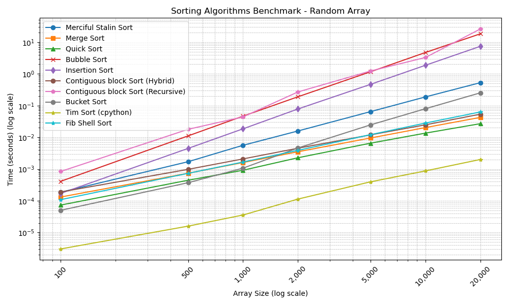
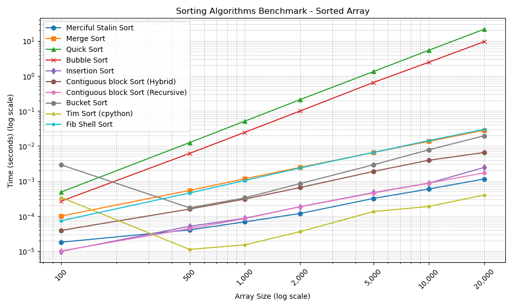
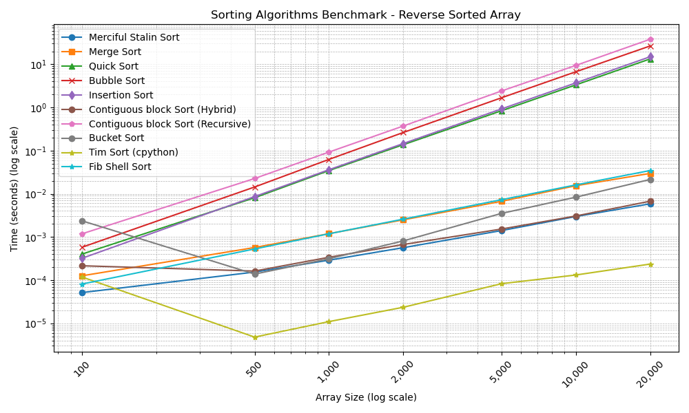
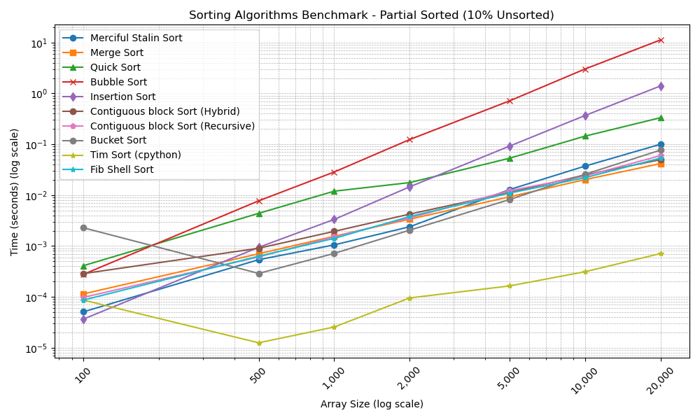
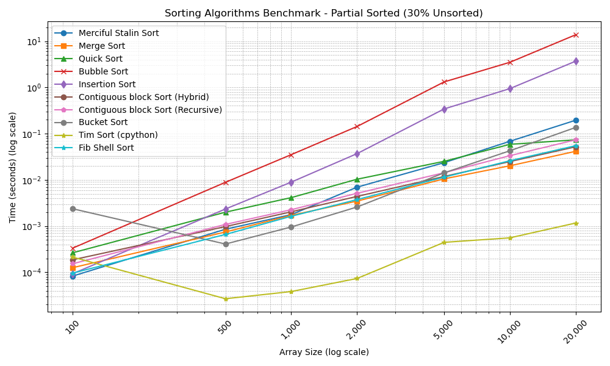
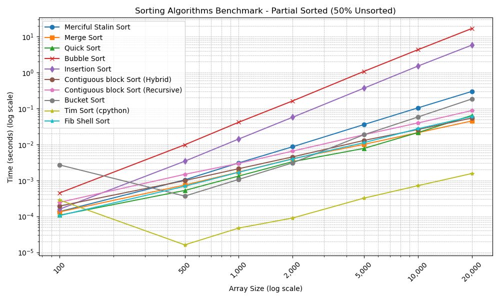

# Merciful Stalin Sort

The **Merciful Stalin Sort** is a new sorting algorithm inspired by the infamous [Stalin Sort](https://en.wikipedia.org/wiki/Sorting_algorithm#Stalin_sort). While experimenting with Stalin Sort as a playful exercise, an intriguing idea emerged: instead of discarding out-of-order elements, what if we **retained the in-order elements and recursively sorted the rest**? The logic was that by reducing the size of the array needing sorting, we could achieve performance gains, especially on partially sorted arrays. This led to the development of the Merciful Stalin Sort.

## Development and Concept

The original Stalin Sort operates by iterating through an array and eliminating any element that is out of order, effectively "purging" it to produce a sorted array of the remaining elements. This extreme approach, while humorous, is not useful for most practical uses.

In developing the Merciful Stalin Sort (see commit history), the initial implementation involved a single forward pass through the array, collecting elements that were in ascending order and recursively sorting the out-of-order elements. However, this approach was inefficient for arrays that were sorted in reverse order, as it resulted in extensive recursion and poor performance.

To address this, the algorithm was enhanced by adding a **backward pass**. After the forward pass collects elements in ascending order, the backward pass iterates through the remaining elements in reverse, collecting elements that are in descending order. This addition significantly improved performance on reverse-sorted arrays by reducing the depth of recursion and handling both increasing and decreasing sequences within the array.

## Algorithm Overview

The Merciful Stalin Sort operates in three main phases:

1. **Forward Pass**: Iterate through the array from the beginning, retaining elements that are in ascending order. Out-of-order elements are collected into a separate array.

2. **Backward Pass**: Iterate through the out-of-order elements from the end, retaining elements that are in descending order. Remaining elements are collected into another array.

3. **Merge and Recursive Sort**: Merge the sorted elements from the forward and backward passes. If there are remaining unsorted elements, recursively apply the Merciful Stalin Sort to them and merge the result with the previously merged array.

This algorithm reduces the problem size by sorting smaller subsets of the array and merging them, similar to merge sort. The addition of the backward pass allows the algorithm to handle both ascending and descending sequences effectively.

## Time Complexity Analysis

### Best Case: O(n)

The best-case scenario occurs when the array is already sorted in either ascending or descending order. In this case, the forward pass or backward pass will collect all elements into the sorted array without any remaining elements to sort recursively. The algorithm performs a single pass through the array, resulting in linear time complexity.

### Average Case and Worst Case: O(n log n)

In the average case and worst case, the array contains a mix of ordered and unordered elements. The algorithm reduces the size of the problem at each recursive call by collecting in-order elements during the forward and backward passes. Each level of recursion handles a fraction of the array, and the depth of the recursion tree is logarithmic relative to the number of elements.

At each recursive call, the array is partitioned into three parts:

- **Forward-Sorted Elements**: Elements collected during the forward pass.
- **Backward-Sorted Elements**: Elements collected during the backward pass.
- **Remaining Unsorted Elements**: Elements that were not collected during either pass.

Assuming that the forward and backward passes collectively collect a constant fraction of the elements, the size of the remaining unsorted portion decreases geometrically with each recursive call. This results in a recursion depth of O(log n).

At each level of recursion, the algorithm performs O(n) work:

- The forward and backward passes each take O(n) time.
- Merging the sorted arrays also takes O(n) time.

Therefore, the total time complexity is O(n log n), as the O(n) work is performed at each of the O(log n) levels of recursion.

**NB:** It is impossible for an array to have all elements unordered in both the forward and backward passes simultaneously. This inherent design ensures that each pass successfully reduces the size of the unsorted portion of the array geometrically, preventing an O(n²) runtime and maintaining the algorithm's efficiency by ensuring progress is made at every recursive step.

## Empirical Results and Analysis

Comprehensive benchmarking was conducted to evaluate the performance of the Merciful Stalin Sort against traditional sorting algorithms: Merge Sort, Quick Sort, Bubble Sort, Insertion Sort

Arrays of varying sizes and initial orders were used: Random Arrays, Sorted Arrays, Reverse-Sorted Arrays, Partially Sorted Arrays with 10%, 30%, and 50% unsorted elements

**Detailed benchmarking results can be found in `results.txt`.**

#### Random Arrays

In random arrays, the Merciful Stalin Sort underperforms compared to Merge Sort and Quick Sort. The overhead from the forward and backward passes, along with recursive calls, contributes to its inefficiency on unsorted data. The graph shows that as the array size increases, the execution time of Merciful Stalin Sort grows more rapidly than that of Merge Sort and Quick Sort. However, it outperforms Bubble Sort and Insertion Sort, particularly on larger arrays.

#### Sorted Arrays

On sorted arrays, the algorithm performs efficiently, comparable to Insertion Sort. The forward pass collects all elements, and no recursive calls are necessary, resulting in linear time complexity. The graph indicates minimal execution times that grow linearly with the array size, demonstrating the algorithm's efficiency in this scenario.

#### Reverse-Sorted Arrays

Similar to a sorted array, the backward pass efficiently collects all elements in descending order, minimizing recursive calls. The performance is similar to that on sorted arrays, as reflected in the graph, where execution times remain low and scale linearly with the array size.

Note: Without the backward pass, this senario was the worst case for Merciful Stalin sort where it even underperformed Bubble Sort and Insertion Sort.

#### Partially Sorted Arrays

|10% Unsorted|30% Unsorted|50% Unsorted|
|:-:|:-:|:-:|
||||

The algorithm shows improved performance as the degree of sortedness increases. It benefits from the initial passes collecting larger sorted sequences, reducing the size of the arrays needing recursive sorting. Merciful Stalin Sort seems to performs better with fewer unsorted elements. For an array with only 10% unsorted elements, it even rivals Merge Sort, however as the sortedness of an array decreases, it starts to lags behind Merge Sort and Quick Sort, which are less sensitive to initial ordering.

### Performance of Merciful Stalin Sort

*The graph illustrates the execution time of Merciful Stalin Sort across different array types and sizes. Logarithmic scales are used for clarity.*

The empirical results indicate that while the Merciful Stalin Sort slightly benefits from the initial ordering of elements, it cannot match the efficiency of algorithms like Merge Sort and Quick Sort on large or randomly ordered datasets. The overhead of multiple passes and recursive calls becomes significant as the array size increases. Furthermore, the for each recursive call, the algorithm is not able to elementate sufficient elements to make any meaningful performance gains. 

In comparison with Bubble Sort and Insertion Sort, the Merciful Stalin Sort performs better on larger arrays, particularly when the array is partially sorted. This highlights its relatively better average-case performance compared to these simple sorting algorithms.

## Potential Improvements

### Heuristic-Based Pass Direction

Incorporate a heuristic to determine whether to perform a forward pass, a backward pass, or both by assessing the array's overall orderliness or calculating a "sortedness score" based on adjacent element comparisons. For instance, counting the number of ascending versus descending pairs can help decide the most efficient pass direction, reducing unnecessary computations and optimizing performance for arrays with clear directional trends.

### Adaptive Starting Point

Optimize the initial passes by starting from the array's midpoint and moving outward, particularly for arrays with specific patterns such as increasing sequences towards the ends or a central peak. By identifying the index of the maximum or minimum element, the algorithm can adaptively choose where to begin, maximizing the number of in-order elements collected during the initial passes and thereby reducing recursion depth and overall execution time.

## Conclusion

The Merciful Stalin Sort introduces an interesting concept by attempting to optimize sorting through selective element retention and recursion. However, empirical testing indicates that it does not outperform traditional sorting algorithms for most general usecases. The algorithm excels when the array is already sorted, partially sorted or reverse-sorted manner but struggles with random data.

## Like My Work?

If you find this to be a cool algorithm or like the analysis, please consider giving it a star on GitHub! 🌟

If you'd like to improve this project, feel free to submit a pull request or open an issue 🚀 Collaboration and feedback are always welcome.

If you just have a question or want to talk, don't hesitate to reach out! 💬✨